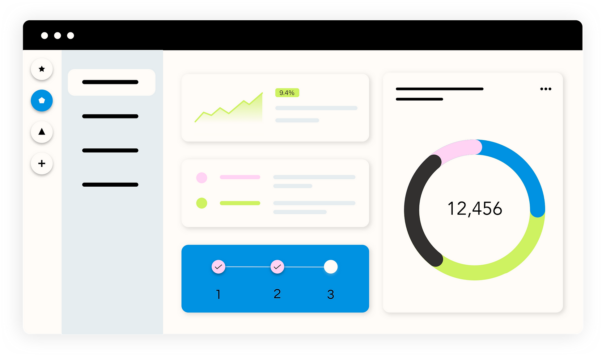

# Nova Bot Studio  

        

**The ultimate AI‑powered bot platform for automation – design, integrate and manage bots without writing code.**  

[Demo](#) • [Documentation](#) • [Issues](https://github.com/GURUDAS-DEV/NOVA-BOT-STUDIO/issues) • [Pull Requests](https://github.com/GURUDAS-DEV/NOVA-BOT-STUDIO/pulls)

---

## Overview  

Nova Bot Studio is a modern SaaS‑style dashboard built with **Next.js 16** and **TailwindCSS** that lets you:

* **Create** AI chat‑bots in minutes using a drag‑and‑drop visual flow editor.  
* **Connect** to popular messaging platforms – Telegram, Discord, Instagram, WhatsApp – or a custom webhook.  
* **Manage** bots, view real‑time statistics and control access from a unified admin panel.  

The platform is fully **client‑side rendered** for a snappy experience, while a separate backend provides authentication, bot orchestration and analytics via a REST API.

> **Target audience** – product managers, marketers, community managers, and developers who need a fast way to launch conversational agents without maintaining infrastructure.

**Current version:** `v0.2.1` (development)

---

## Features  

| Category | Feature | Status |
|----------|---------|--------|
| **Bot Builder** | Visual flow editor with pre‑built templates | ✅ Stable |
| | AI response generation (OpenAI / Claude integration) | 🟡 Beta |
| **Integrations** | Telegram, Discord, Instagram, WhatsApp | ✅ Stable |
| | Custom webhook (any HTTP endpoint) | ✅ Stable |
| **Dashboard** | Real‑time bot statistics (messages, uptime, active bots) | ✅ Stable |
| | Multi‑tenant user management (role‑based) | 🟡 Beta |
| **Theming** | Dark / Light mode powered by `next-themes` | ✅ Stable |
| **Notifications** | Toast notifications via `sonner` | ✅ Stable |
| **Animations** | UI transitions with `radix-ui` and `tw-animate-css` | ✅ Stable |
| **3D Preview** | Interactive 3‑D bot avatar using `three` | 🟡 Experimental |
| **Export / Import** | JSON export/import of bot configurations | ✅ Stable |
| **API** | REST endpoints for auth, bot CRUD, analytics (backend) | ✅ Stable |
| **Bot Config Editor** | Full‑screen “Edit Bot Config – Website FreeStyle” UI for per‑bot HTML/CSS/JS customization | ✅ Stable |
| **Deployment** | One‑click Vercel deployment & Docker support | ✅ Stable |
| **Analytics** | Built‑in usage analytics visualised in the dashboard | ✅ Stable |
| **Internationalisation** | Basic i18n support for UI strings | 🟡 Beta |

---

## Tech Stack  

| Layer | Technology | Reason |
|-------|------------|--------|
| **Framework** | **Next.js 16** (React 19) | File‑system routing, API routes, hybrid SSR/CSR |
| **Language** | **TypeScript** | End‑to‑end type safety |
| **Styling** | **TailwindCSS 4**, `tw-animate-css` | Utility‑first, rapid UI prototyping |
| **State Management** | **Zustand** | Minimalist global store (`useAuthStore`, `useBotStore`) |
| **UI Components** | **Radix UI**, `lucide-react`, `react-icons` | Accessible primitives & icons |
| **Theming** | `next-themes` | Dark / Light mode |
| **Animations** | `sonner`, `tw-animate-css` | Toasts & CSS‑based animations |
| **3D** | `three` | Optional 3‑D bot preview |
| **Utilities** | `clsx`, `class-variance-authority`, `dotenv` | Class handling & env loading |
| **Email** | `resend` | Transactional email (password reset, invites) |
| **Testing / Linting** | `eslint`, `eslint-config-next`, `prettier` | Code quality enforcement |
| **Build & Deploy** | `next build`, Vercel, Docker | Optimized production bundles & containerisation |

---

## Architecture  

```
src/
├─ app/
│  ├─ (private)      ← Auth‑protected UI (dashboard)
│  │   ├─ layout.tsx          ← Global layout with Sidebar & TopBar
│  │   ├─ Sidebar.tsx         ← Collapsible navigation
│  │   ├─ TopBar.tsx          ← User menu, theme switch, notifications
│  │   ├─ home/
│  │   │   ├─ page.tsx        ← Dashboard home
│  │   │   └─ Edit-Bot-Config/
│  │   │       └─ Website/
│  │   │           └─ FreeStyle/
│  │   │               └─ (id)/
│  │   │                   └─ page.tsx   ← “Edit Bot Config – Website FreeStyle” page
│  │   └─ …                    ← Other private sections (create, manage, stats)
│  ├─ (public)       ← Public‑facing pages (landing, FAQ, pricing)
│  │   └─ Footer.tsx
│  └─ page.tsx       ← Root page (redirects based on auth)
├─ components/
│  └─ ui/            ← Re‑usable UI primitives (Button, Spinner, …)
├─ lib/
│  ├─ Store/         ← Zustand stores (auth, bot data)
│  ├─ Types/         ← TypeScript interfaces
│  ├─ analytics/     ← Analytics helpers
│  └─ utils.ts       ← API wrappers, formatters, misc helpers
└─ proxy.ts          ← Optional API‑proxy for server‑side requests
```

* **Routing** – Next.js file‑system routing separates public and private routes using the `(public)` and `(private)` folders.  
* **Auth** – `useAuthStore` holds `isLoggedIn`, `userId`, `username`, `email` and provides helpers like `refreshUser` and `logout`.  
* **Environment** – `NEXT_PUBLIC_API_BASE_URL` points to the backend API (e.g., `https://api.nova-bot.studio`).  
* **Config Editor** – The `Edit‑Bot‑Config/Website/FreeStyle/(id)/page.tsx` component renders a rich editor that lets users modify HTML/CSS/JS snippets for a specific bot (`id`). Changes are persisted via the backend PATCH endpoint `/api/bots/:id`.

---

## Getting Started  

### Prerequisites  

| Tool | Minimum version |
|------|-----------------|
| **Node.js** | 20.x |
| **npm** | 10.x (or `pnpm` / `yarn` – same commands) |
| **Git** | any recent version |
| **Vercel CLI** (optional) | 32.x for local preview |
| **Docker** (optional) | 24.x for containerised dev |

A running **backend API** that implements authentication, bot CRUD and analytics is required. Supply its URL via `NEXT_PUBLIC_API_BASE_URL`.

### Installation  

```bash
# 1️⃣ Clone the repository
git clone https://github.com/GURUDAS-DEV/NOVA-BOT-STUDIO.git
cd NOVA-BOT-STUDIO

# 2️⃣ Install dependencies
npm ci   # or `pnpm install` / `yarn install`

# 3️⃣ Copy the example environment file
cp .env.example .env.local
```

### Configuration  

Create (or edit) `.env.local` at the project root:

```dotenv
# Public – injected into the client bundle
NEXT_PUBLIC_API_BASE_URL=https://api.yourdomain.com

# Private – used only by server‑side code (if any)
RESEND_API_KEY=your_resend_api_key
```

> **Note:** Variables prefixed with `NEXT_PUBLIC_` are exposed to the browser. All other variables remain server‑only.

### Verify the installation  

```bash
npm run dev
```

Open <http://localhost:3000>. You should see the public landing page. After logging in (or using the mock auth flow), you’ll be redirected to the dashboard.

---

## Usage  

### Development workflow  

| Command | Description |
|---------|-------------|
| `npm run dev` | Starts the Next.js dev server (`http://localhost:3000`) with hot‑reloading. |
| `npm run build` | Generates an optimized production build in `.next`. |
| `npm start` | Serves the production build locally (`NODE_ENV=production`). |
| `npm run lint` | Lints the codebase using ESLint (Next.js config). |
| `npm run test` | Placeholder – add Jest/Playwright tests here. |
| `npm run format` | Runs Prettier to format all files. |

### Example: Creating a bot (client side)

```tsx
import { useState } from "react";
import { Button } from "@/components/ui/button";

export const CreateBot = () => {
  const [loading, setLoading] = useState(false);

  const handleCreate = async () => {
    setLoading(true);
    const res = await fetch(
      `${process.env.NEXT_PUBLIC_API_BASE_URL}/api/bots`,
      {
        method: "POST",
        credentials: "include",
        headers: { "Content-Type": "application/json" },
        body: JSON.stringify({
          name: "My First Bot",
          platform: "telegram",
          template: "customer-support",
        }),
      }
    );

    if (res.ok) {
      // Refresh UI or navigate to the bot detail page
      window.location.href = "/home/manage";
    } else {
      const err = await res.json();
      console.error("Bot creation failed:", err);
    }
    setLoading(false);
  };

  return (
    <Button onClick={handleCreate} disabled={loading}>
      {loading ? "Creating…" : "Create Bot"}
    </Button>
  );
};
```

### Example: Editing a website bot’s FreeStyle configuration

```tsx
import { useEffect, useState } from "react";
import { useRouter } from "next/navigation";
import { Button } from "@/components/ui/button";

export default function EditFreeStylePage() {
  const router = useRouter();
  const { id } = router.query as { id: string };
  const [config, setConfig] = useState({ html: "", css: "", js: "" });
  const [saving, setSaving] = useState(false);

  // Load existing config
  useEffect(() => {
    if (!id) return;
    fetch(`${process.env.NEXT_PUBLIC_API_BASE_URL}/api/bots/${id}`, {
      credentials: "include",
    })
      .then((r) => r.json())
      .then((data) => setConfig(data.freeStyle || { html: "", css: "", js: "" }));
  }, [id]);

  const handleSave = async () => {
    setSaving(true);
    await fetch(`${process.env.NEXT_PUBLIC_API_BASE_URL}/api/bots/${id}`, {
      method: "PATCH",
      credentials: "include",
      headers: { "Content-Type": "application/json" },
      body: JSON.stringify({ freeStyle: config }),
    });
    setSaving(false);
    router.push("/home/manage");
  };

  return (
    <div className="p-6 space-y-4">
      <h1 className="text-2xl font-bold">Edit FreeStyle – Bot {id}</h1>

      <textarea
        className="w-full h-40 p-2 border rounded"
        placeholder="HTML"
        value={config.html}
        onChange={(e) => setConfig({ ...config, html: e.target.value })}
      />
      <textarea
        className="w-full h-40 p-2 border rounded"
        placeholder="CSS"
        value={config.css}
        onChange={(e) => setConfig({ ...config, css: e.target.value })}
      />
      <textarea
        className="w-full h-40 p-2 border rounded"
        placeholder="JavaScript"
        value={config.js}
        onChange={(e) => setConfig({ ...config, js: e.target.value })}
      />

      <Button onClick={handleSave} disabled={saving}>
        {saving ? "Saving…" : "Save Changes"}
      </Button>
    </div>
  );
}
```

Navigate to `/home/Edit-Bot-Config/Website/FreeStyle/[id]` after selecting a bot to open the editor.

### UI Navigation  

* **Sidebar** – Click any navigation item (`Home`, `Create Bot`, `Manage Bots`, `Integrations`, `Edit Bot Config`) to load the corresponding page.  
* **TopBar** – Access user menu (profile, settings, logout) and toggle dark/light mode.  
* **Responsive** – Layout collapses to a hamburger menu on screens < 768 px.

### Screenshots  

| Landing page | Dashboard |
|---|---|
|  |  |

*(Images are stored in `public/` and render automatically when the app runs.)*

---

## Development  

### Setting up the development environment  

```bash
# Install dependencies (already done in Getting Started)
npm ci

# Run the dev server
npm run dev
```

### Testing  

> **Note:** The repository currently contains placeholder scripts. Add your preferred testing framework (e.g., Jest, Playwright) and update `package.json` accordingly.

```bash
npm run test
```

### Code style  

* **Linting** – `npm run lint` uses ESLint with the Next.js preset.  
* **Formatting** – `npm run format` runs Prettier.  
* **Commit messages** – Follow the Conventional Commits specification for easier changelog generation.

### Debugging tips  

* Use the browser’s DevTools to inspect network requests to `NEXT_PUBLIC_API_BASE_URL`.  
* The `useAuthStore` and `useBotStore` hooks expose their state via the React DevTools extension.  
* Enable verbose logging in `src/lib/utils.ts` by setting `NEXT_PUBLIC_DEBUG=true` in `.env.local`.

---

## Deployment  

### Vercel (recommended)

1. Sign in to [Vercel](https://vercel.com) and import the repository.  
2. Set the following environment variables in the Vercel dashboard:  

   | Name | Value |
   |------|-------|
   | `NEXT_PUBLIC_API_BASE_URL` | `https://api.yourdomain.com` |
   | `RESEND_API_KEY` | *(your Resend key)* |
   | `NEXT_PUBLIC_DEBUG` | `false` |

3. Deploy – Vercel will automatically run `npm ci && npm run build` and serve the app on a generated URL.

### Docker

```bash
# Build the image
docker build -t nova-bot-studio:latest .

# Run the container (replace env vars as needed)
docker run -p 3000:3000 \
  -e NEXT_PUBLIC_API_BASE_URL=https://api.yourdomain.com \
  -e RESEND_API_KEY=your_resend_api_key \
  -e NODE_ENV=production \
  nova-bot-studio:latest
```

The app will be reachable at <http://localhost:3000>.

### Self‑Hosted (Node)

```bash
npm run build
npm start   # runs `next start` on port 3000 by default
```

Make sure the environment variables are present in `.env.production` or exported in the shell.

---

## API Documentation  

> The backend API is **not** part of this repository. Below is a quick reference for the endpoints the frontend expects. Adjust the base URL via `